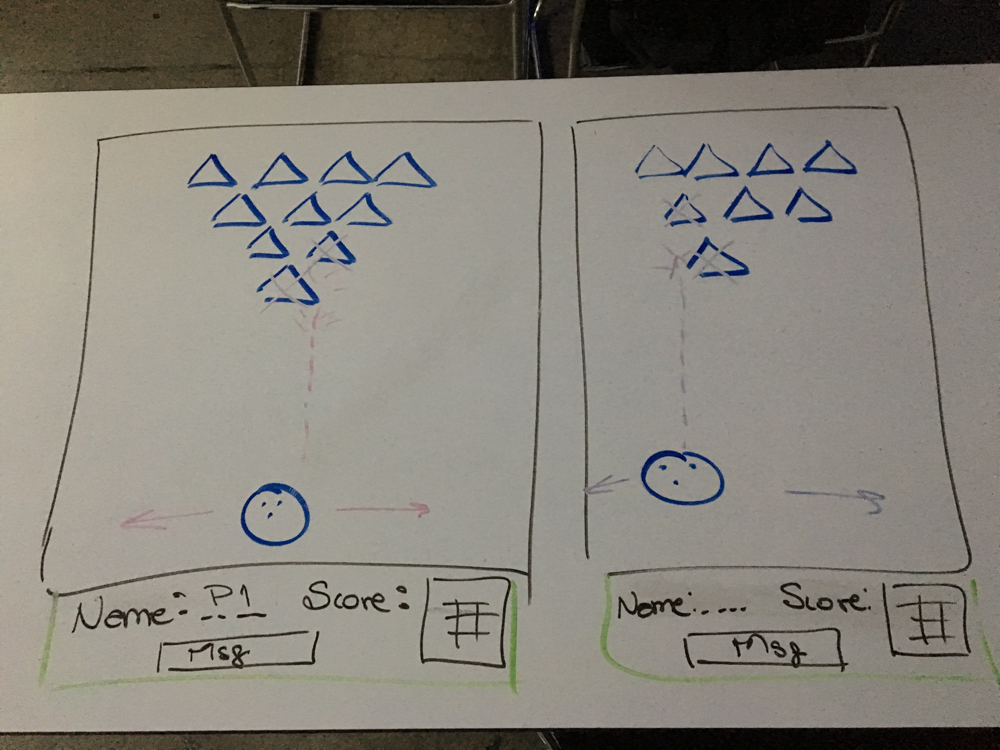

##BOWLINCK  

###Description  

This game is a version of digital Bowling, where you can move the ball to the right or left, with arrows (<- \ ->), once you located the ball where you want to hit, you click the 'up arrow ^' towards the 10 pins, once you hit the ball, you can still move it to right or left to hit the pins and every time you hit a pin, you score one point, but remember! according to the level you choose, you have a certain amount of shoots and velocity of the ball, if you hit all the pins within the amount of shoots, you win!!! If not... obviuosly you lose...! But you can always try again, just click on the Reset button and you are good to go!

###Technologies Used  
<li> HTML5</li>
<li> CSS3</li>
<li> JavaScript</li>
<li> jQuery</li>
<li> Canvas</li>

###Installation Instructions  
- Play on your browser! [Go to Bowlinck](https://vivirishe.github.io/Project1_Bowlinck/)

- Download Instructions:

	- Step 1: Clone the repository.

	- Step 2: Open index.html in your browser.

###Approach Taken  
In this project, I used Canvas technology from HTML5, which it was something new, I had the chance to explore and play with it, I used it to draw the board and all the components (10 pins and the bowling ball). I used JavaScript for the win logic, jQuery for all the events and the DOM and CSS for the styling.

###Unsolved Problems  
The first Unsolved problem is to add a loop to draw the pins.
Second Unsolved problem is add spin to the ball.
Third Unsolved problem is to add more players and keep the scores for tournament.

###Links  
<li>[Go to Bowlinck](https://vivirishe.github.io/Project1_Bowlinck/)</li>
<li>
[Trello User Story](https://trello.com/b/qxDf3qKw/project-1)
</li>

By: Viviana Rishe
